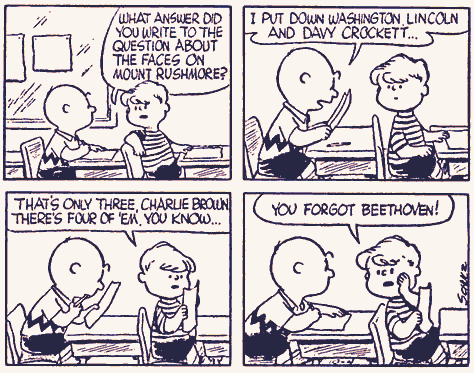

<div align="center">
  
  

  # Quizzer
  
  **CLI App for Quizzes. Gives You the Ability to Create, Edit, share your own quizzes and practice with them using .YAML**
  [](#link-to-compiler-support)
  [](#link-to-os)
  [](https://github.com/jbeder/yaml-cpp)
  [](#link-to-license)
  <br />
</div>

## Table of Contents
- [Getting Started](#-getting-started)
  - [Prerequisites](#prerequisites)
  - [Building from Source](#building-from-source)
- [Usage](#-usage)
  - [Question Formatting](#-question-formatting)
- [Troubleshooting](#-troubleshooting)

---

## Getting Started

### Prerequisites

To build Quizzer on Linux, you will need:
- A **C++17** compatible toolchain ([GCC](https://gcc.gnu.org/) or [Clang](https://clang.llvm.org/))
- [**CMake**](https://cmake.org/) (≥ 3.12)
- [**yaml-cpp**](https://github.com/jbeder/yaml-cpp) (Development package)

> Remark: You do not have to strictly maintain this versioning, however this is what  I have personally tested on.
### Building from Source

**1. Install Dependencies (Ubuntu/Debian)**
```bash
sudo apt-get update
sudo apt-get install -y build-essential cmake libyaml-cpp-dev
```

**2. Clone and Build**
```bash
git clone https://github.com/YOUR_USERNAME/quizzer.git
cd quizzer

mkdir -p build && cd build
cmake ..
cmake --build . --config Release
```

**3. Run**
```bash
./bin/quizzer ../quiz.yaml
```
*(If run without arguments, it defaults to looking for `./quiz.yaml`)*

> **Alternative Manual Compilation:**  
> If `yaml-cpp` is installed system-wide, you can compile directly without CMake:
> ```bash
> g++ -std=c++17 -Wall -Wextra -Wpedantic -O2 main.cpp -lyaml-cpp -o quizzer
> ```

---

## Usage

Once launched, Quizzer will attempt to load the target YAML file. If it doesn't exist or is empty, Quizzer initializes a fresh workspace. 

From the main menu, you can navigate via standard numeric inputs:
1. **Take Quiz** 
2. **Add Question** 
3. **Remove Question** 
4. **Change Answer** 
5. **List Questions** 
6. **Save and Exit** 

**Adding Code Snippets & Explanations:**
When adding a new question interactively, the CLI will ask: `Include a code snippet? (y/n)`. 
If you choose `y`, simply paste your multi-line code into the terminal. To finish the block, type a single line containing only the word `END`. The exact same workflow applies to adding explanations!
> The same applies for `explain`.

---

## Question Formatting

Quizzer stores your questions in a straightforward YAML sequence and stores these as properties of the question.

```yaml
- question: "In Python, what is the time complexity of the following code?"
  explain: |
    See that there exist two running indices (i & j).
    Therefore, this has the time-complexity of O(n^2)
  code: |
    def function(n):
        result = 0
        for i in range(n):
            for j in range(i, n):
                result += 1
        return result
  choices:
    - "O(n)"
    - "O(n log n)"
    - "O(n^2)"
    - "O(n^3)"
  answer: 2

```

> **Remark:** 
> - `answer` is **0-based** in the YAML file, but the CLI automatically translates this to a **1-based** index.
> - The `code` and `explain` block is entirely optional, and can be added. When provided, it is visually separated in the terminal output.
> - see example file `example_quiz.yaml` for a template you can edit/the desired formatting.
---

## Troubleshooting

<details>
<summary><b>Missing <code>yaml-cpp</code> dependency</b></summary>
<br/>
If your compiler complains about missing YAML headers, ensure you have the dev package installed:
<ul>
  <li><b>Debian/Ubuntu:</b> <code>sudo apt-get install libyaml-cpp-dev</code></li>
  <li><b>Fedora/RHEL:</b> <code>sudo dnf install yaml-cpp-devel</code></li>
</ul>
</details>

<details>
<summary><b>Unable to save (Permission Denied)</b></summary>
<br/>
Check the write permissions of the directory and the target YAML file. Quizzer requires write access to serialize the updated state back to disk.
</details>

<details>
<summary><b>Invalid YAML Parsing Errors</b></summary>
<br/>
Ensure your manually edited YAML follows the correct schema: it must be a sequence (list) of maps (dictionaries). Required keys are <code>question</code>, <code>choices</code>, and <code>answer</code>. <code>code</code> and <code>explanation</code> are optional.
</details>

---

<div align="center">
  Made by <a href="https://github.com/trintlermint">@trintlermint</a>. <br/>
  If you found this project useful, consider leaving a star, or even better: write an issue with the problems you faced or any feedback!
</div>
