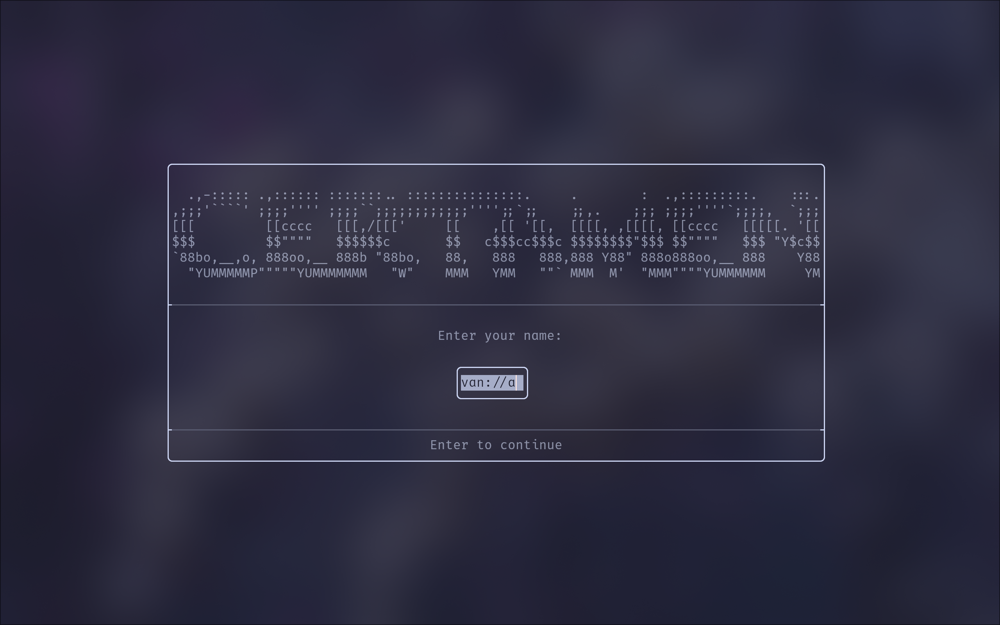
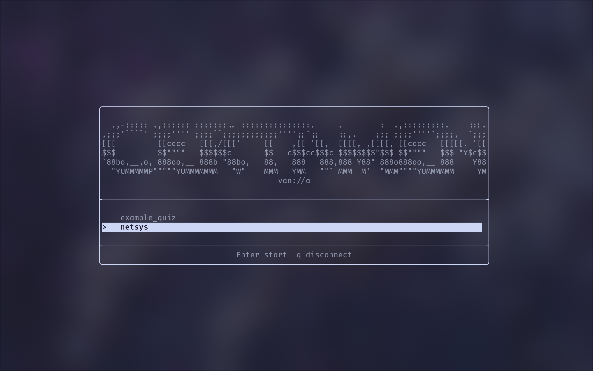
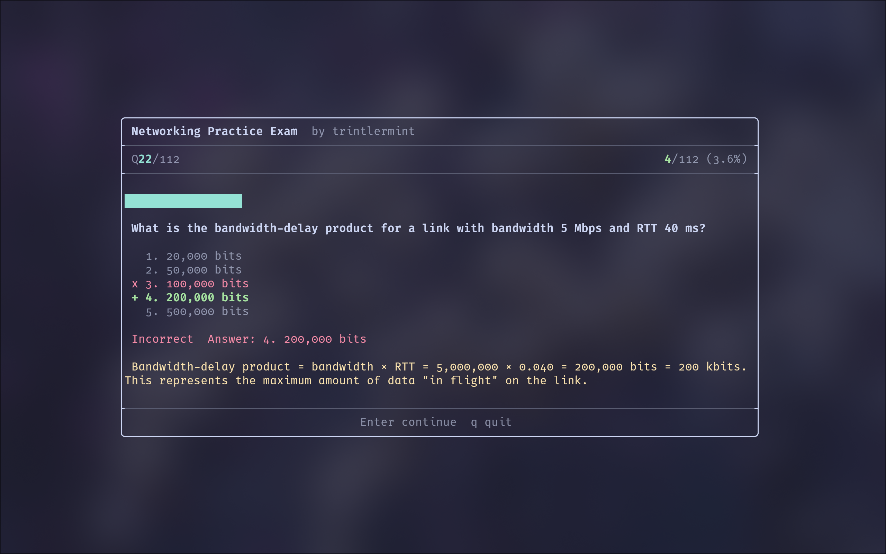

# Certamen SSH Server

Any machine running `certamen serve` becomes a quiz server that `<N>` clients can connect to with a standard SSH client.
<p align="center">
  
  
  
</p>

## Start

```bash
# Start serving a quiz (port `2222`, no password)
certamen serve quiz.yaml

# With password
certamen serve --password mysecret quiz.yaml

# Multiple quizzes on a custom port
certamen serve --port 3000 --password mysecret algebra.yaml history.yaml
```

Clients connect with:

```bash
ssh -p 2222 yourname@server-ip
```

The username becomes the player's display name, and the server sees the connected users.

## Options

| Flag | Default | Description |
|------|---------|-------------|
| `--port <N>` | 2222 | Port to listen on |
| `--password <pw>` | *none* | Requires this password to connect clients |
| `--key <path>` | `certamen_host_rsa` | Path to RSA host key |
| `--max-clients <N>` | 8 | Maximum simultaneous connections |

## Huh? Why so overcomplicated?

1. Server generates an RSA host key on first run (saved to `certamen_host_rsa`)
2. Client connects via SSH, authenticates with password (if set)
3. Server forks a PTY child running the quiz TUI
4. Client sees a name prompt, then quiz selection (if multiple files), then the quiz
5. On completion, the server logs the client's score

Each client gets their own session. The server handles multiple concurrent connections up to `--max-clients`.

## Authentication

**Open** (default): Any SSH client can connect without a password (after fingerprinting). The SSH username is used as the player name.

**Password**: Pass `--password <pw>` to require authentication. Clients will be prompted for the password by their SSH client. Failed attempts are logged.

> REMARK: Password is having some issues right now.

```bash
# Server
certamen serve --password quiznight quiz.yaml

# Client
ssh -p 2222 vanilla@192.168.1.10
# SSH client prompts for password
```

## Client Limits

The `--max-clients` flag caps concurrent connections. When the limit is reached, new connections are rejected until an existing client disconnects.

```bash
certamen serve --max-clients 20 quiz.yaml
```

## Logging

All server activity prints to stdout/stderr with timestamps:

```
[2026-03-26 20:15:03] Certamen SSH server listening on port 2222
[2026-03-26 20:15:03] Auth: password required
[2026-03-26 20:15:03]   Quiz: algebra.yaml
[2026-03-26 20:15:10] Connection accepted (1/8)
[2026-03-26 20:15:10] Authenticated: alice (password)
[2026-03-26 20:15:10] PTY: 120x40 term=xterm-256color user=alice
[2026-03-26 20:15:10] Session started: user=alice pid=54321
[2026-03-26 20:18:45] METRICS [vanilla]: player=vanilla
[2026-03-26 20:18:45] METRICS [vanilla]: quiz=algebra.yaml
[2026-03-26 20:18:45] METRICS [vanilla]: score=8/10
[2026-03-26 20:18:45] Session ended: user=alice pid=54321 exit=0
[2026-03-26 20:18:45] Disconnected: vanilla
```

Redirect to a file for persistent logs:

```bash
certamen serve quiz.yaml 2>&1 | tee certamen.log
```

## Metrics

After each client finishes a quiz, the server logs their results:

```
METRICS [username]: player=alice
METRICS [username]: quiz=algebra.yaml
METRICS [username]: score=8/10
```

Metrics are written per-session to a /tmp/ file, read by the server after the session ends, then cleaned up, you can do whatever you desire with that.

## Network Setup

**LAN**: Clients on the same network connect directly to the server's local IP.

**Internet**: Forward the port (default 2222) on your router.

**DNS**: Point hostname at the server for easier access:

```bash
ssh -p 2222 player@quiz.example.com
```

## Host Key

On first run, the server generates `certamen_host_rsa` in the working directory. Clients will see a host key fingerprint prompt on first connection.

To use an existing key:

```bash
certamen serve --key /path/to/host_key quiz.yaml
```

The key file must be readable only by the owner (permissions `0600`). The server sets this automatically for generated keys.

## Stopping the Server

Press `Ctrl+C`. The server shuts down. Active sessions finish by themselves in their own right.

```
^C
[2026-03-26 20:30:00] Shutting down.
```

## Session Flow

What clients experience:

1. *Name prompt*; centered input field asking for their name
2. *Quiz picker**; if the server hosts multiple quizzes, a menu to choose one
3. *Quiz*; standard quiz UI
4. *Results*; score display with gauge, then back to quiz picker (or disconnect)

Clients can press `Escape` at the name prompt to disconnect, or `q` in the quiz picker.

## Troubleshooting

**"Connection refused"**: Server isn't running, wrong port, or firewall blocking.

**"Connection closed" immediately**: Check logs. Likely a key exchange failure (incompatible SSH client) or the host key file is corrupted. Delete `certamen_host_rsa` and restart to regenerate.

**"Permission denied"**: Wrong password, or server requires a password and client didn't provide one.

**Client sees garbled output**: The client terminal may not support the `TERM` type. Try `TERM=xterm ssh -p 2222 ...`.

**Quiz doesn't render correctly**: Terminal must be at least 60 columns wide. Resize before connecting. Sorry about this
